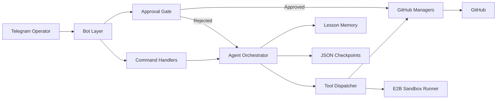
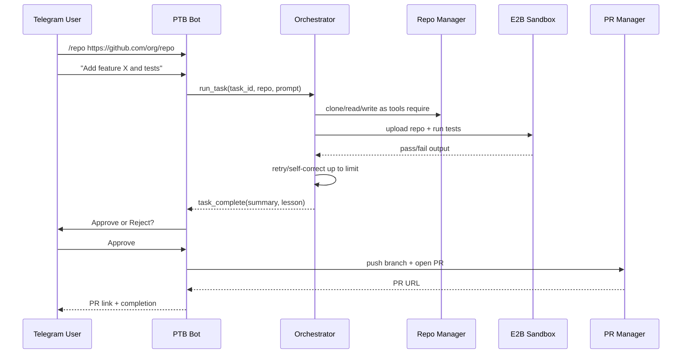
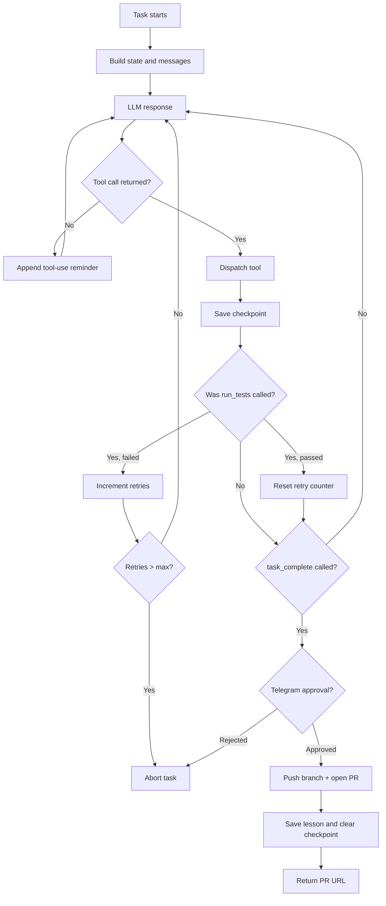
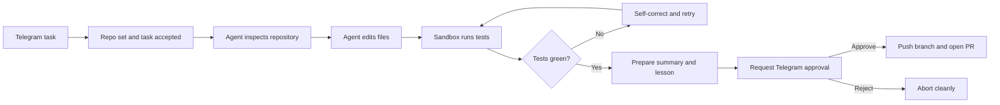

# ClawCode

Telegram-controlled autonomous coding agent for GitHub repositories.

ClawCode lets a single trusted Telegram operator send a coding task from a
phone, have an agent inspect a repository, edit code, run tests inside an E2B
sandbox, recover from failures, and only open a pull request after explicit
approval in Telegram.

## Why This Exists

ClawCode is built for a simple but high-trust workflow:

- You want to dispatch real coding work from your phone.
- You want the agent to explore, edit, and test autonomously.
- You do not want it to push or open a PR without approval.
- You want crash recovery, auditability, and repo-specific memory.

In short: autonomous execution with a human approval gate.

## Core Capabilities

- Telegram bot entrypoint for commands, free-text tasks, and voice notes
- Repository cloning, file reads, file writes, branch creation, commits, pushes
- Pull request creation through GitHub after operator approval
- E2B sandbox execution for isolated dependency install and `pytest` runs
- Agent loop with tool calling, retry limits, checkpointing, and resume support
- Repo-scoped semantic memory for lessons learned from prior tasks
- Railway-ready deployment and LangGraph/LangSmith local observability support

## High-Level Architecture



## End-to-End Task Flow



## Runtime Control Graph



## Tech Stack

| Area | Tooling |
|---|---|
| LLM | Groq `qwen/qwen3-32b` |
| Bot | `python-telegram-bot` 21.x |
| GitHub API | `PyGithub` |
| Git operations | `GitPython` |
| Sandbox | `e2b-code-interpreter` |
| Memory | `chromadb` + `sentence-transformers` |
| Voice transcription | Groq Whisper |
| Orchestration | `langgraph`, `langchain`, `langchain-groq` |
| Retries | `tenacity` |
| Config | `python-dotenv`, `pydantic` |
| Testing | `pytest`, `pytest-asyncio`, `pytest-cov` |
| Packaging | `uv` |
| Deployment | Railway |

## Repository Layout

```text
ClawCode/
├── main.py
├── config/
├── bot/
├── agent/
├── gh/
├── sandbox/
├── memory/
├── checkpoints/
├── tests/
├── Procfile
├── railway.toml
├── pyproject.toml
└── uv.lock
```

## Module Responsibilities

| Path | Responsibility |
|---|---|
| `main.py` | Entry point and dependency wiring |
| `config/settings.py` | Environment loading, validation, runtime settings |
| `bot/handler.py` | PTB application construction and routing |
| `bot/commands.py` | Telegram commands, task kickoff, resume, status |
| `bot/approval.py` | Approval gate and callback coordination |
| `bot/voice.py` | Voice-note transcription support |
| `agent/orchestrator.py` | Main agent loop, state transitions, retries, completion |
| `agent/tools.py` | Tool schemas and dispatch layer |
| `agent/checkpoints.py` | Persistent JSON checkpoint operations |
| `agent/memory.py` | Agent-facing lesson recall/save helpers |
| `agent/llm.py` | LLM client integration and retry behavior |
| `agent/wiring.py` | Production dependency composition |
| `gh/repo_manager.py` | Clone, branch, file operations, commits, push |
| `gh/pr_manager.py` | Pull request creation and PR-side interactions |
| `sandbox/e2b_runner.py` | Sandbox startup, repo upload, test execution, shutdown |
| `memory/store.py` | Chroma-backed lesson persistence and retrieval |

## Safety Model

ClawCode is intentionally conservative around write operations that escape the
local task loop.

- Only Telegram users in `TELEGRAM_ALLOWED_USER_IDS` are allowed to operate it.
- The agent can edit and test autonomously, but it cannot publish without
  explicit Telegram approval.
- It never pushes directly to the default branch.
- Repository code is meant to run in E2B, not on the host machine.
- Checkpoints are written after tool progress so tasks can be resumed safely.
- Approval callbacks are protected and restricted to allowed operators.

## Current Behavior

The planned six phases are complete and the project is now in maintenance and
iteration mode.

Recent maintenance work includes:

- concurrent Telegram update handling during active tasks
- stronger approval callback allowlist enforcement
- hard green-test gating before completion
- checkpoint-backed `/resume <task_id>` recovery
- reliable E2B repo re-uploading before test runs
- temporary clone cleanup and default-branch detection

## Local Setup

### 1. Create the environment

```bash
uv venv --python 3.11
uv sync --all-groups
cp .env.example .env
```

Fill in the required values in `.env`.

### 2. Required environment variables

```env
GROQ_API_KEY=
TELEGRAM_BOT_TOKEN=
TELEGRAM_ALLOWED_USER_IDS=123456789
GITHUB_TOKEN=
GITHUB_DEFAULT_BRANCH=main
E2B_API_KEY=
LOG_LEVEL=INFO
CHECKPOINT_DIR=./checkpoints
CHROMA_DIR=./chroma_data
MAX_TEST_RETRIES=3
```

### 3. Run the bot

```bash
uv run python main.py
```

## Developer Workflow

### Quality checks

```bash
uv run ruff check .
uv run black --check .
uv run pytest tests/ -v
```

### Coverage run

```bash
uv run pytest tests/ -v --cov=. --cov-fail-under=70
```

### LangGraph Studio

```bash
uv run langgraph dev
```

If you want LangSmith tracing, set:

```env
LANGCHAIN_TRACING_V2=true
LANGCHAIN_API_KEY=...
LANGCHAIN_PROJECT=clawcode
```

## Telegram Commands

| Command | Purpose |
|---|---|
| `/start` | Start or verify bot access |
| `/repo <url>` | Set the active GitHub repository |
| `/status` | Show current task state |
| `/history` | Show recent task history |
| `/cancel` | Cancel the active task |
| `/resume <task_id>` | Resume from the latest checkpoint |

Free text is treated as a task once a repository is set. Voice notes are
transcribed and treated as task input as well.

## What a Successful Task Looks Like



## Testing Strategy

The test suite mirrors the major subsystems:

- `tests/test_settings.py` validates env parsing and failures
- `tests/test_bot.py` covers routing, auth, and command behavior
- `tests/test_repo_manager.py` and `tests/test_pr_manager.py` cover GitHub ops
- `tests/test_e2b_runner.py` covers sandbox execution and failure modes
- `tests/test_orchestrator.py` covers retries, checkpointing, and completion
- `tests/test_agent_memory.py` and `tests/test_memory_store.py` cover memory
- `tests/test_voice.py` covers voice transcription integration

## Important Constraints

- Python 3.11+
- `async` for I/O-heavy paths
- secrets only via `.env`
- no direct pushes to default branch
- no PR without Telegram approval
- no repo code execution on the host outside the sandbox model
- `uv` is the package manager and runner

## Documentation

- [Agent instructions](/Users/ayush/Projects/ClawCode/AGENTS.md)

## Status

This repository is no longer a skeleton. The core loop, Telegram control
surface, GitHub managers, sandbox runner, memory layer, retries, checkpoint
resume flow, and Railway deploy scaffolding are all present. The current work
is refinement, operational hardening, and live deployment verification.
